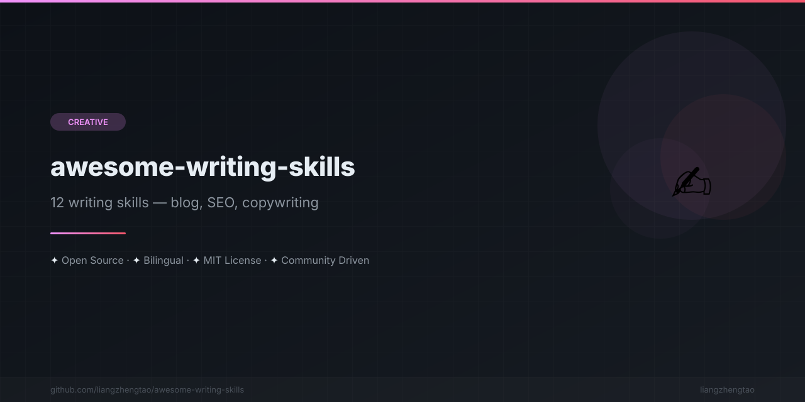

[English](README.md) | [中文](README.zh.md) | [日本語](README.ja.md) | [Français](README.fr.md) | [Español](README.es.md) | [العربية](README.ar.md) | [한국어](README.ko.md) | [Português](README.pt.md) | [Русский](README.ru.md) | [Deutsch](README.de.md)
n<div align="center">



</div>


# ✍️ Awesome Writing Skills

<p align="center">
  <strong>Stop staring at blank pages. 12 AI writing skills for bloggers, marketers, and professionals.</strong>
</p>

<p align="center">
  <a href="#-skills-overview">Skills</a> •
  <a href="#-quick-start">Quick Start</a> •
  <a href="#-before--after">Before/After</a> •
  <a href="#-contributing">Contributing</a>
</p>

---

## 🎯 The Problem

You sit down to write. The cursor blinks. Minutes pass. You write a sentence, delete it, write it again.

**Sound familiar?** Whether it's a blog post, sales email, research abstract, or business report — the hardest part is knowing *how* to structure what you want to say.

## ✅ The Solution

12 tried-and-true AI writing skills, each a complete playbook with:

- **When to Use** — clear triggers for when each skill applies
- **Writing Framework** — step-by-step structure to follow
- **Templates** — fill-in-the-blank starting points
- **Power Words & Phrases** — language that works
- **Common Mistakes** — pitfalls to avoid
- **Before/After Examples** — see the transformation

---

## 📋 Skills Overview

| # | Category | Skill | What It Does |
|---|----------|-------|--------------|
| 1 | 📝 博客写作 | [SEO Blog Post](skills/博客写作/seo-blog-post.md) | Write SEO-optimized blog posts that rank |
| 2 | 📝 博客写作 | [Technical Blog](skills/博客写作/technical-blog.md) | Explain complex topics clearly |
| 3 | 📝 博客写作 | [Newsletter Writing](skills/博客写作/newsletter-writing.md) | Write newsletters people actually read |
| 4 | 💰 文案营销 | [Sales Copy](skills/文案营销/sales-copy.md) | Write copy that converts |
| 5 | 💰 文案营销 | [Social Media Copy](skills/文案营销/social-media-copy.md) | Platform-specific social content |
| 6 | 💰 文案营销 | [Email Marketing](skills/文案营销/email-marketing.md) | Emails that get opened and clicked |
| 7 | 🎓 学术写作 | [Research Abstract](skills/学术写作/research-abstract.md) | Abstracts that get accepted |
| 8 | 🎓 学术写作 | [Grant Proposal](skills/学术写作/grant-proposal.md) | Proposals that get funded |
| 9 | 🎨 创意写作 | [Storytelling](skills/创意写作/storytelling.md) | Stories that captivate |
| 10 | 🎨 创意写作 | [Content Rewriting](skills/创意写作/content-rewriting.md) | Transform mediocre content |
| 11 | 💼 职场写作 | [Business Report](skills/职场写作/business-report.md) | Reports that drive decisions |
| 12 | 💼 职场写作 | [Presentation Script](skills/职场写作/presentation-script.md) | Scripts that hold attention |

---

## 🚀 Quick Start

### For AI Assistants (Claude, ChatGPT, Kimi, etc.)

1. **Copy** the skill file content that matches your task
2. **Paste** it as system instructions or context
3. **Provide** your specific topic, audience, and requirements
4. **Get** a polished, structured piece of writing

### For Writers

1. **Browse** the skills table above
2. **Open** the relevant skill file
3. **Follow** the step-by-step framework
4. **Use** the templates as starting points

---

## 🔄 Before / After

### Before: A Blank Page

```
I need to write a blog post about productivity tips.

... (staring at cursor for 20 minutes) ...
```

### After: Using [SEO Blog Post](skills/博客写作/seo-blog-post.md)

```markdown
# 15 Productivity Tips That Actually Work (Backed by Science)

**Meta Description:** Discover 15 proven productivity tips used by top performers.
Learn time management, focus techniques, and habit-building strategies.

## Introduction (Hook)
"80% of people feel overwhelmed by their workload." — American Psychological Association

You've read every productivity article out there. Tried the Pomodoro Technique.
Downloaded three different apps. Yet here you are, still drowning in tasks.

The problem isn't lack of tips — it's using the *right* tips for *your* situation.

## Tip 1: The Two-Minute Rule
[Framework continues with structured, SEO-optimized content...]
```

**The difference?** A clear framework eliminates decision fatigue and gives you a proven structure to fill in — not a blank page to fill from scratch.

---

## 📁 Project Structure

```
awesome-writing-skills/
├── README.md                          # This file
├── LICENSE                            # MIT License
├── CONTRIBUTING.md                    # How to contribute
├── CODE_OF_CONDUCT.md                 # Community guidelines
├── SECURITY.md                        # Security policy
├── CHANGELOG.md                       # Version history
├── .gitignore
├── .github/
│   ├── workflows/ci.yml              # CI validation
│   ├── ISSUE_TEMPLATE/               # Issue templates
│   └── pull_request_template.md      # PR template
└── skills/
    ├── 博客写作/                      # Blog Writing (3 skills)
    │   ├── seo-blog-post.md
    │   ├── technical-blog.md
    │   └── newsletter-writing.md
    ├── 文案营销/                      # Copywriting (3 skills)
    │   ├── sales-copy.md
    │   ├── social-media-copy.md
    │   └── email-marketing.md
    ├── 学术写作/                      # Academic Writing (2 skills)
    │   ├── research-abstract.md
    │   └── grant-proposal.md
    ├── 创意写作/                      # Creative Writing (2 skills)
    │   ├── storytelling.md
    │   └── content-rewriting.md
    └── 职场写作/                      # Professional Writing (2 skills)
        ├── business-report.md
        └── presentation-script.md
```

---

## 🤝 Contributing

We welcome contributions! See [CONTRIBUTING.md](CONTRIBUTING.md) for guidelines.

**Ways to contribute:**
- 🆕 Add new writing skills
- 📝 Improve existing templates
- 🌐 Add translations
- 🐛 Fix errors or outdated advice

---

## 📄 License

This project is licensed under the MIT License - see the [LICENSE](LICENSE) file for details.

---

## ⭐ Star This Repo

If you find these skills useful, give us a star! It helps others discover this resource.

---

<p align="center">
  <strong>Stop staring. Start writing.</strong><br>
  <em>告别空白页面，开始高效写作。</em>
</p>

---
